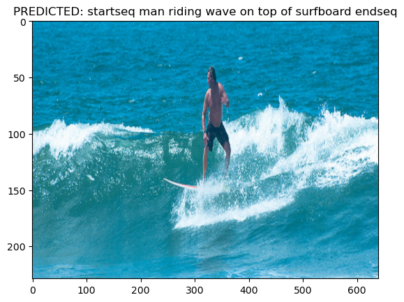

# Image-Captioning
Deep Learning Model That Generates Text to a Given Image. 

It is a CNN-LSTM network.

The model was trained with 118287 train images and evaluated with BLEU metric on 5000 validation images.

### Features
- Python 3.10
- Keras
- CNN architecture for feature extraction (VGG16)
- LSTM for generating text
- Trained and tested with MSCOCO dataset (2017 version): https://cocodataset.org/#download
- Platform: Jupyter Notebook

### Libraries
- pandas
- keras
- visualkeras
- nltk
- numpy
- PIL
- tqdm

### Scores
- **B-1**: 0.642
- **B-2**: 0.411
- **B-3**: 0.272
- **B-4**: 0.173

### Developed Model Architecture

### Example 1

### Example 2

### Example 3

### Example 4

### Example 5

### Example 6

**Note**: The generator from the following code was implemented to the developed mode: https://github.com/aswintechguy/Deep-Learning-Projects/tree/main/Image%20Caption%20Generator%20-%20Flickr%20Dataset
